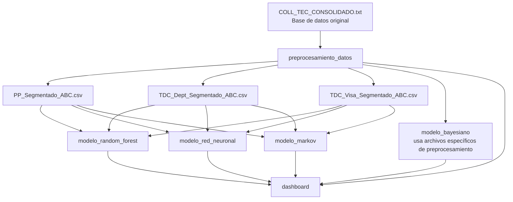

# 💰 Sistema Inteligente de Cobranza

Bienvenido al repositorio del **Sistema Inteligente de Cobranza**, una plataforma integral de análisis, segmentación y predicción del comportamiento de pago de clientes, desarrollada con técnicas avanzadas de Ciencia de Datos, Machine Learning y Estadística Bayesiana.

Este sistema permite visualizar, modelar y anticipar el comportamiento de pago de clientes de productos financieros como préstamos personales y tarjetas de crédito (departamentales y Visa), con el fin de optimizar las estrategias de cobranza y gestión del riesgo.

---

## 🧭 Estructura del Repositorio

```plaintext
📁 analisis_demografico/        # Análisis sociodemográfico inicial
📁 dashboard/                   # Interfaz visual interactiva con Streamlit
📁 modelo_bayesiano/            # Modelos probabilísticos bayesianos (R + MCMC)
📁 modelo_markov/               # Análisis de comportamiento con Cadenas de Markov
📁 modelo_random_forest/        # Modelos de regresión con Random Forest
📁 modelo_red_neuronal/         # Modelos con redes neuronales (MLP)
📁 preprocesamiento_datos/      # EDA, segmentación ABC y feature selection
poster bradescard.pdf          # Poster académico con información relevante del proyecto
README.md                      # Este archivo ✨
```

## 🔄 Flujo de Trabajo del Proyecto


---

## 📦 Módulos del Proyecto

### 🧪 `preprocesamiento_datos/`
Contiene el análisis exploratorio inicial, segmentación ABC y selección de variables para cada producto. Los archivos `.csv` generados aquí son usados por los demás módulos.

> ✅ Ver [README de preprocesamiento](preprocesamiento_datos/README.md) para detalles y orden de ejecución.

---

### 📊 `modelo_random_forest/`
Modelos de regresión Random Forest que predicen cuánto pagará un cliente en el siguiente mes.

| Producto           | MAE    |
|--------------------|--------|
| Préstamo Personal  | 18.52  |
| TDC Departamental  | 7.77   |
| TDC Visa           | 19.48  |

> 📄 Ver [README de Random Forest](modelo_random_forest/README.md)

---

### 🧠 `modelo_red_neuronal/`
Implementación de un perceptrón multicapa (MLP) para regresión.

| Producto           | MAE    |
|--------------------|--------|
| Préstamo Personal  | 38.49  |
| TDC Departamental  | 8.31   |
| TDC Visa           | 39.81  |

> 📄 Ver [README de Red Neuronal](modelo_red_neuronal/README.md)

---

### 📐 `modelo_markov/`
Análisis del comportamiento de pago como procesos estocásticos con **Cadenas de Markov**. Define 6 estados de morosidad por cliente y calcula matrices de transición por producto.

- Estados: No pagó, Pagó < mínimo, Pagó mínimo, Pagó > mínimo, Pago completo, Desactivado
- Salida: clúster de comportamiento proyectado a partir del último estado

> 📄 Ver [README de Markov](modelo_markov/README.md)

---

### 📈 `modelo_bayesiano/`
Modelos generativos implementados en R usando métodos **Bayesianos + MCMC** para estimar la probabilidad de pago. Ventajas:

- Incorpora incertidumbre de parámetros
- Regularización con priors
- Permite actualización secuencial con nuevos datos

> 📄 Ver [README de Bayesiano](modelo_bayesiano/README.md)

---

### 🌍 `analisis_demografico/`
Estudio exploratorio del perfil de clientes con base en su edad, sexo, localización y uso de productos financieros.

> 📄 Ver [README de Análisis Demográfico](analisis_demografico/README.md)

---

### 🖥️ `dashboard/`
Interfaz interactiva construida con **Streamlit** para mostrar resultados y predicciones de todos los modelos.

- Visualiza y predicciones por producto
- Simula escenarios y haz predicciones en tiempo real
- Información condensada sobre el alcance del proyecto

> 📄 Ver [README del Dashboard](dashboard/README.md)

---

## 📌 Requisitos

- Python 3.10+
- R 4.2+ (para modelos bayesianos)
- Quarto (para correr `.qmd`)
- Bibliotecas Python:
  - pandas, numpy, scikit-learn, matplotlib, seaborn, tensorflow
  - streamlit, joblib, plotly
- R Packages:
  - `brms`, `mgcv`, `tidyverse`

---

## 🧠 Motivación

La gestión eficiente del riesgo financiero requiere más que clasificaciones binarias de clientes. Este sistema ofrece un enfoque **multimodelo, interpretativo y actualizable** que permite:

- Comprender patrones históricos
- Segmentar clientes con base en comportamiento real
- Predecir montos y probabilidades de pago con diversos enfoques
- Identificar riesgos de impago y priorizar esfuerzos de cobranza

---

## 🧑‍💻 Autores y Créditos

* Santiago Mora Cruz
* Gabriel Eduardo Meléndez Zavala
* Melanie Astrid Montaño Ramos
* Victoria González González
* María Fernanda Gamboa Martínez

> Estudiantes de Ingeniería en Ciencia de Datos y Matemáticas; como parte del proyecto de predicción de comportamiento crediticio en colaboración con Bradescard.

---

> ⚠️ **Nota:** Toda la información y los modelos aquí presentados se desarrollaron con fines académicos y experimentales. Para ser utilizados directamente en producción deben ser evaluados previamente.
