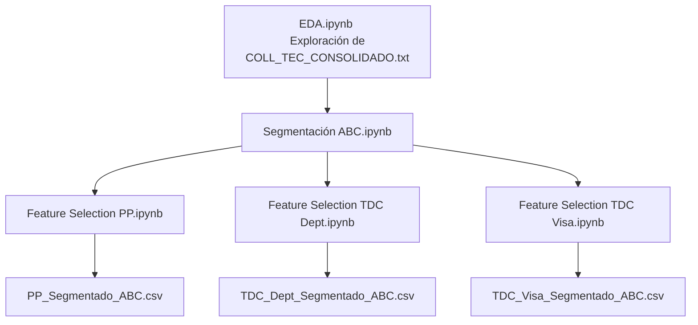

# 🧹 Preprocesamiento de Datos

Esta carpeta contiene el flujo completo de preprocesamiento aplicado a la base de datos proporcionada por Bradescard (`COLL_TEC_CONSOLIDADO.txt`). A partir de este archivo se generan tres bases de datos segmentadas y enriquecidas que son utilizadas en los modelos de regresión, análisis con cadenas de Markov y otros módulos del proyecto.

---

## 🧭 Objetivo

Transformar, explorar, segmentar y seleccionar características relevantes de la base de datos original para producir datasets optimizados por tipo de producto:

- `PP_Segmentado_ABC.csv` (Préstamos Personales)
- `TDC_Dept_Segmentado_ABC.csv` (Tarjetas Departamentales)
- `TDC_Visa_Segmentado_ABC.csv` (Tarjetas Visa)

---

## 📁 Contenido de la Carpeta

| Notebook | Descripción |
|----------|-------------|
| `EDA.ipynb` | Análisis exploratorio inicial (EDA) sobre la base original. |
| `Segmentacion_ABC.ipynb` | Segmentación de clientes por método ABC según saldo o relevancia. |
| `Feature_Selection_PP.ipynb` | Selección de variables para Préstamos Personales. |
| `Feature_Selection_TDC_Dept.ipynb` | Selección de variables para TDC Departamental. |
| `Feature_Selection_TDC_Visa.ipynb` | Selección de variables para TDC Visa. |

---

## 🔄 Flujo de Trabajo

## ✔️ Feature Selection

Los notebooks:

* `Feature_Selection_TDC_Visa.ipynb`
* `Feature_Selection_TDC_Dept.ipynb`
* `Feature_Selection_TDC_PP.ipynb`

Dan información de las variables más importantes y relevantes en la base de datos para hacer predicciones, pero si sólo se quiere obtener las bases de datos limpias que usan los modelos, podrían solo ejecutarse los primeros dos notebooks.

## 📦 Entrada
`COLL_TEC_CONSOLIDADO.txt`: Base de datos original proporcionada por Bradescard con registros históricos de pagos, saldos, límites, fechas, producto y más información relevante de los clientes.

## 📤 Salida
Los siguientes archivos `.csv` son los datasets limpios y enriquecidos generados tras todo el flujo de preprocesamiento:

* `PP_Segmentado_ABC.csv`

* `TDC_Dept_Segmentado_ABC.csv`

* `TDC_Visa_Segmentado_ABC.csv`

## 🛠️ Tecnologías Usadas

Python 3.10+

pandas

numpy

matplotlib / seaborn

scikit-learn

## 🚀 Cómo usar
Asegúrate de tener el archivo `COLL_TEC_CONSOLIDADO.txt` en el directorio raíz o especifica correctamente la ruta en los notebooks.

Ejecuta los notebooks en el orden siguiente:

1. `EDA.ipynb`

2. `Segmentacion ABC.ipynb`

3. `Feature Selection PP.ipynb` (opcional)

4. `Feature Selection TDC Dept.ipynb` (opcional)

5. `Feature Selection TDC Visa.ipynb` (opcional)

Verifica que los archivos `.csv` generados aparezcan correctamente. Estos serán usados por los modelos posteriores.